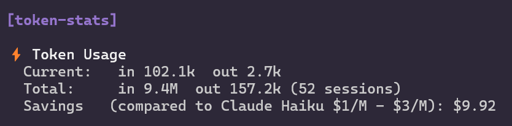

# token-stats

Token usage statistics for [pi-mono](https://github.com/badlogic/pi-mono). Shows total tokens spent across all sessions.

## Install

Copy `token-stats.ts` into your extensions directory:

```bash
cp token-stats.ts ~/.pi/agent/extensions/token-stats.ts
```

Or install from this repo:

```bash
git clone https://github.com/Richi-78/pi-tweak.git ~/.pi/pi-tweak
cp ~/.pi/pi-tweak/extensions/token-stats.ts ~/.pi/agent/extensions/token-stats.ts
```

## Features

- Current session token usage (input/output)
- Total tokens across all sessions
- Estimated savings vs. cloud models
- Cache read/write statistics

## Configuring Cloud Model Pricing

Edit the `CLOUD_MODEL` object in `token-stats.ts` to change the comparison baseline:

```typescript
const CLOUD_MODEL = {
  name: "Claude Haiku",       // Display name
  inputPerM: 1.0,             // $ per million input tokens
  outputPerM: 3.0,            // $ per million output tokens
  currency: "$",              // Currency symbol
};
```

### Example: GPT-4o-mini pricing

```typescript
const CLOUD_MODEL = {
  name: "GPT-4o-mini",
  inputPerM: 0.15,
  outputPerM: 0.60,
  currency: "$",
};
```

### Example: Claude 3.5 Sonnet pricing

```typescript
const CLOUD_MODEL = {
  name: "Claude 3.5 Sonnet",
  inputPerM: 3.0,
  outputPerM: 15.0,
  currency: "$",
};
```

## Screenshot


